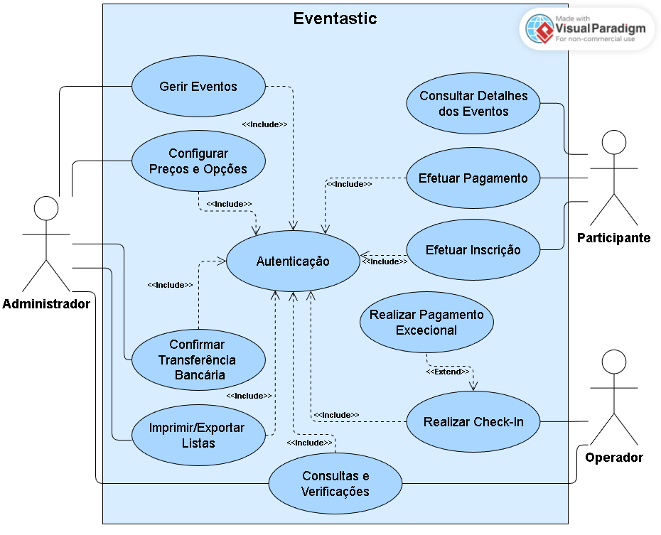

<!-- 3. Use Cases -->

# 3. Use Cases

## 3.1 Diagrama de Use Cases

   

## 3.2 Descrição Textual de Use Cases

### UC 1: Autenticação
| **UC** | Autenticação |
|:--------:|-------------------|
| **Ator Principal** | Administrador, Operador e Participante |
| **Objetivo** | Permitir que utilizadores acedam às funcionalidades do sistema de acordo com o perfil. |
| **Pré-condições** | O utilizador está na página de login. |
| **Comportamento Normal** | <ol> <li>O Utilizador insere as credenciais (email e palavra-passe).</li> <li>O Sistema valida as credenciais.</li> <li>O Sistema concede acesso ao painel correspondente:</li> <ul> <li> Administrador &rarr; Menu de gestão de eventos.</li> <li> Operador &rarr; Menu de check-in.</li> <li> Participante &rarr; Menu de inscrição e consulta de eventos. </li> </ul> </ol>|
| **Extensões** | **2a. Credenciais Inválidas:** O Sistema notifica o Utilizador que as credenciais estão incorretas, voltando ao passo 1. |

 

### UC 2: Gerir Evento
| **UC** | Gerir Evento |
|:--------:|-------------------|
| **Ator Principal** | Administrador |
| **Objetivo** | Criar eventos. |
| **Pré-condições** | Administrador autenticado (UC 1). |
| **Comportamento Normal** | <ol> <li>O administrador seleciona a opção “Criar novo evento".</li> <li>Insere informações obrigatórias (nome, descrição, local, datas, horários, número máximo de participantes, período global de inscrições).</li> <li>Define fases de inscrição (early, late, durante o evento) e preços distintos por tipo de inscrição (estudante/não estudante).</li> <li>Define opções adicionais (almoço, jantar, coffee-break), indicando preço e se são obrigatórias ou opcionais.</li> <li>Confirma e guarda o evento.</li> <li>Sistema regista o evento e torna-o visível na lista de eventos (caso o período de inscrições esteja aberto).</li> </ol>|
| **Extensões** | **5a. Dados Incompletos/Inválidos:** O sistema apresenta um erro de validação. Volta ao Passo 2. |

 

### UC 3: Configurar Preços e Opções 
| **UC** | Configurar Preços e Opções |
|:--------:|-------------------|
| **Ator Principal** | Administrador |
| **Objetivo** | Definir os preços das fases de inscrição (early, late ou durante o evento) e configurar as opções adicionais do evento (almoço, jantar, cofee-break). |
| **Pré-condições** | <ul> <li>O Administrador está autenticado (UC 1).</li> <li>O evento já foi criado (UC 2).</li> </ul> |
| **Comportamento Normal** | <ol> <li>O Administrador seleciona o evento que pretende configurar.</li> <li>O Administrador acede à secção “Preços e Opções”.</li> <li>O Sistema apresenta as fases de inscrição disponíveis (early, late, durante o evento), com os respetivos campos para introdução de preços por tipo de inscrição (estudante / não estudante).</li> <li>O Administrador introduz ou atualiza os preços para cada fase e cada tipo de inscrição.</li> <li>O Administrador acede à área de opções adicionais.</li> <li>O Sistema apresenta a lista de opções adicionais existentes para o evento ou campos para criação de novas opções.</li> <li>O Administrador configura opções adicionais, definindo: <ul> <li>nome da opção</li> <li>preço</li> <li>se é obrigatória ou opcional</li> </ul> </li> <li>O Administrador guarda as configurações.</li> <li>O Sistema atualiza o evento com os novos preços e opções, ficando disponível para o processo de inscrição.</li> </ol> |
| **Extensões** | **4a. Valor Inválido:** Preço negativo ou campo vazio. Volta ao Passo 2. |

 

### UC 4: Consultar Detalhes dos Eventos
| **UC** | Consultar Detalhes dos Eventos |
|:--------:|-------------------|
| **Ator Principal** | Participante |
| **Objetivo** | Permitir ao Participante visualizar a lista de eventos com inscrições abertas e aceder aos detalhes. |
| **Pré-condições** | Nenhuma. |
| **Comportamento Normal** | <ol> <li>O Participante acede à lista de eventos disponíveis com inscrições abertas.</li> <li>O Participante seleciona um evento para aceder à sua página de detalhe.</li> <li>O sistema apresenta a informação do evento (descrição, tipos de inscrição disponíveis, preços por fase temporal, opções adicionais e instruções de pagamento).</li> </ol>|
| **Extensões** | Nenhuma. |

 

### UC 5: Efetuar Inscrição
| **UC** | Efetuar Inscrição |
|:--------:|-------------------|
| **Ator Principal** | Participante |
| **Objetivo** | Permitir ao Participante submeter a sua inscrição e gerar o valor total a pagar. |
| **Pré-condições** | <ul> <li>O evento tem inscrições abertas e não atingiu o número máximo de participações;</li> <li>O Participante está autenticado (UC 1).</li> </ul> |
| **Comportamento Normal** | <ol> <li>O Participante inicia o processo de inscrição e preenche o formulário com os dados pessoais (nome, telefone e morada).</li> <li>O Participante seleciona o tipo de inscrição (estudante ou não estudante) e escolhe as opções adicionais pretendidas (caso sejam opcionais).</li> <li>O sistema identifica automaticamente a fase de inscrição em vigor (early, late ou durante o evento) com base na data atual.</li> <li>O sistema calcula o valor total a pagar através da soma dos preços base correspondentes à fase e ao tipo de inscrição com o valor das opções adicionais.</li> <li>O Participante submete a inscrição.</li> <li>O sistema regista a inscrição no estado "pendente" de pagamento.</li> </ol> |
| **Extensões** | Nenhuma. |

 

### UC 6: Efetuar Pagamento
| **UC** | Efetuar Pagamento |
|:--------:|-------------------|
| **Ator Principal** | Participante |
| **Objetivo** | Efetuar o pagamento da inscrição por tranferência bancária. |
| **Pré-condições** | A inscrição está no estado "pendente" de pagamento (UC 5). |
| **Comportamento Normal** | <ol> <li>O participante seleciona inscrição e acede aos detalhes para pagamento. </li> <li>Insere os dados da tranferência (iban, valor e descrição).</li> <li>O Participante confirma a realização do pagamento.</li> <li>O sistema regista os dados do pagamento e mantém o estado da inscrição como pendente de validação até que seja confirmado pelo administrador.</li> </ol> |
| **Extensões** | Nenhuma. |

 

### UC 7: Confirmar Transferência Bancária
| **UC** | Confirmar Transferência Bancária |
|:--------:|-------------------|
| **Ator Principal** | Administrador |
| **Objetivo** | Registar o pagamento por tranferência bancária, atualizar o estado da inscrição para "paga" e confirmar o pagamento. |
| **Pré-condições** | <ul> <li>O administrador está autenticado (UC 1).</li> <li>Existe uma inscrição no estado "pendente" cujo pagamento ainda não foi confirmado (UC 5).</li></ul> |
| **Comportamento Normal** | <ol> <li>O Administrador acede à lista de inscrições pendentes.</li> <li>O Administrador verifica se o Participante efetuou a transferência.</li> <li>O administrador insere os dados da transferência recebida (valor, data da tranferência e notas).</li> <li>O Administrador confirma a transferência.</li> <li>O Administrador regista a informação do pagamento</li> <li>O sistema altera o estado da inscrição para "paga" e confirma o pagamento.</li> </ol> |
| **Extensões** | **5a. Situações Excecional (Discrepância):** O Administrador deteta que o valor tranferido está incorreto ou a descrição do pagamento não corresponde ao indicado. O administrador pode registar o pagamento mas mantém o estado como "pendente" para posterior correção. Volta ao Passo 1. |

 

### UC 8: Consultas e Verificações
| **UC** | Consultas e Verificações |
|:--------:|-------------------|
| **Ator Principal** | Administrador e Operador |
| **Objetivo** | Permitir que os utilizadores autorizados consultem e verifiquem informações sobre os Participantes para apoio à gestão do evento e ao processo de check-in. |
| **Pré-condições** | Utilizador autenticado como Administrador ou Operador (UC 1). |
| **Comportamento Normal** | <ol> <li>O utilizador seleciona o evento e acede à área de consulta de Participantes.</li> <li>Sistema exibe a lista de Participantes: <ul> <li>**Administrador:** Vê todas as informações detalhadas (tipo de inscrição, opções adicionais, fase de inscrição, valor total, estado do pagamento).</li> <li> **Operador:** Vê informações essenciais para check-in (nome, tipo de inscrição, opções obrigatórias, estado do pagamento).</li> </ul> </li>  <li>O utilizador aplica filtros ou ordenações conforme necessidade.</li> <li>O utilizador verifica inconsistências ou divergências (pagamentos pendentes, inscrições incompletas, dados faltantes).</li> </ol>|
| **Extensões** | **4a. Não existem inscritos:** O sistema apresenta uma mensagem a informar que não há dados para consultar. |

 

### UC 9: Realizar Check-in
| **UC** | Realizar Check-in |
|:--------:|-------------------|
| **Ator Principal** | Operador |
| **Objetivo** | Validar a entrada de um Participante no evento no dia da atividade. |
| **Pré-condições** | O Operador está autenticado (UC 1). |
| **Comportamento Normal** | <ol> <li>O Operador acede à funcionalidade de check-in.</li> <li>O Operador procura o participante pelo nome ou email.</li> <li>O sistema mostra os detalhes da inscrição e o estado do pagamento.</li> <li>O Operador verifica se o estado do pagamento está "paga".</li> <li>O Operador regista o check-in do participante.</li> <li>O sistema atualiza o estado da Inscrição para "check-in".</li> </ol>|
| **Extensões** | <ul> <li>**4a. Pagamento não confirmado:** O sistema indica que o Participante não pode fazer check-in. Volta ao Passo 2.</li> <li>**4b. Pagamento Excecional no Local (Extend: UC 10):** Se a organização permitir, o participante apresenta comprovativo de transferência bancária realizada no momento. O operador aciona o registo do pagamento excecional (UC 10).</li> </ul> |

 

### UC 10: Registar Pagamento Excecional
| **UC** | Registar Pagamento Excecional |
|:--------:|-------------------|
| **Ator Principal** | Operador |
| **Objetivo** | Permitir o registo de um comprovativo de transferência bancária realizada no local para completar o check-in de um participante (Extend do UC 9). |
| **Pré-condições** | O Operador está no passo "Realizar Check-in" e o Participante apresenta o comprovativo da transferência realizada no momento. |
| **Comportamento Normal** | <ol> <li>O Operador insere os dados do comprovativo da transferência excecional (valor, data e descrição).</li> <li>O sistema regista a informação de pagamento e atualiza o estado da inscrição para "paga".</li> <li>Retorna ao passo 5 do UC 9 (registo do check-in).</li> </ol> |
| **Extensões** | Nenhuma. |

 

### UC 11: Imprimir/Exportar Listas
| **UC** | Imprimir/Exportar Listas |
|:--------:|-------------------|
| **Ator Principal** | Administrador |
| **Objetivo** | Gerar documentos com informações dos Participantes para apoio logístico. |
| **Pré-condições** | UC 8 concluído (consulta e verificação dos dados). |
| **Comportamento Normal** | <ol> <li>O Administrador seleciona a opção de imprimir ou exportar listas de Participantes.</li> <li>O sistema gera o documento com as informações dos Participantes (tipo de inscrição, opções adicionais, fase de inscrição, valor total e estado do pagamento).</li> <li>O Administrador imprime ou exporta o documento conforme solicitado.</li> </ol> |

| **Extensões** | **2a. Erro ao gerar documentos:** O sistema apresenta mensagem de erro e permite tentar novamente. Volta ao Passo 1. |
