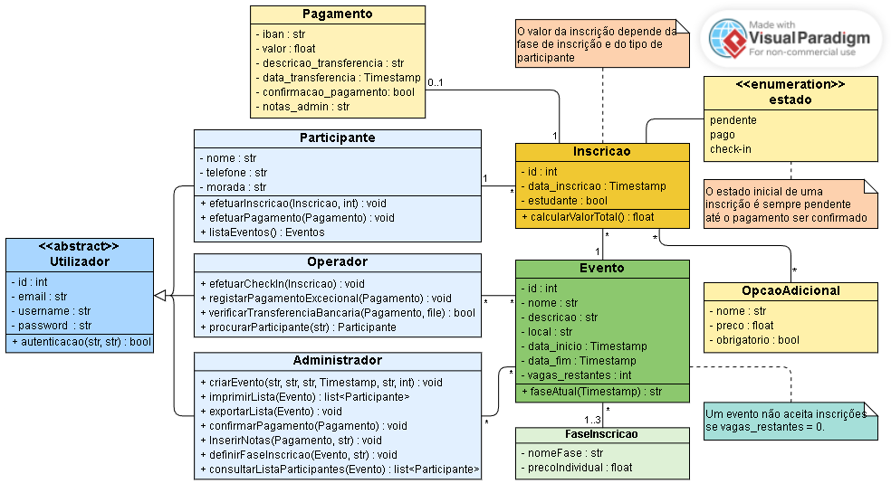

<!-- 4. Diagrama de Classes -->

# 4. Diagrama de Classes

## 4.1 Diagrama de Classes

## 4.2 Introdução do Diagrama de Classes

O diagrama apresentado representa a estrutura principal do sistema, incluindo as classes, atributos e relações entre elas. Descreve entidades como Pagamento, Inscrição, Evento, Participante, Operador, Administrador e a classe abstrata Utilizador, além das enumerações estado e fase_inscricao. Cada classe contém os atributos essenciais e os métodos mais relevantes para a lógica do sistema.

**Nota:** Os métodos `get` e `set` foram omitidos intencionalmente para simplificar a compreensão e visualização do diagrama. Estes métodos, embora cruciais na implementação, não acrescentam valor significativo à compreensão deste diagrama.
