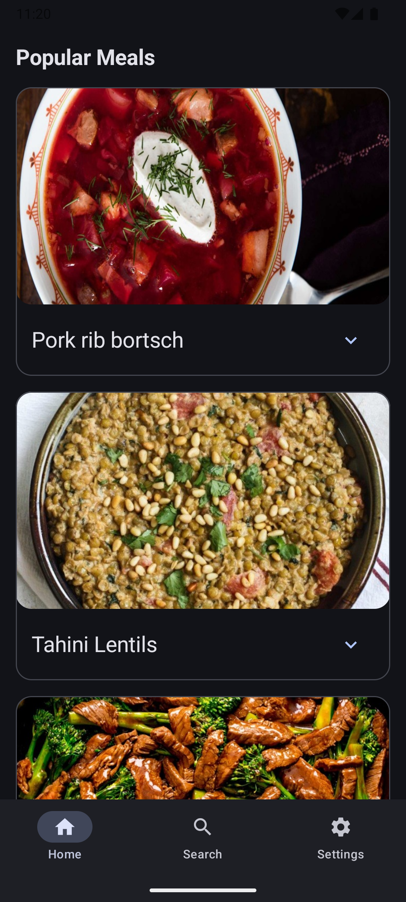
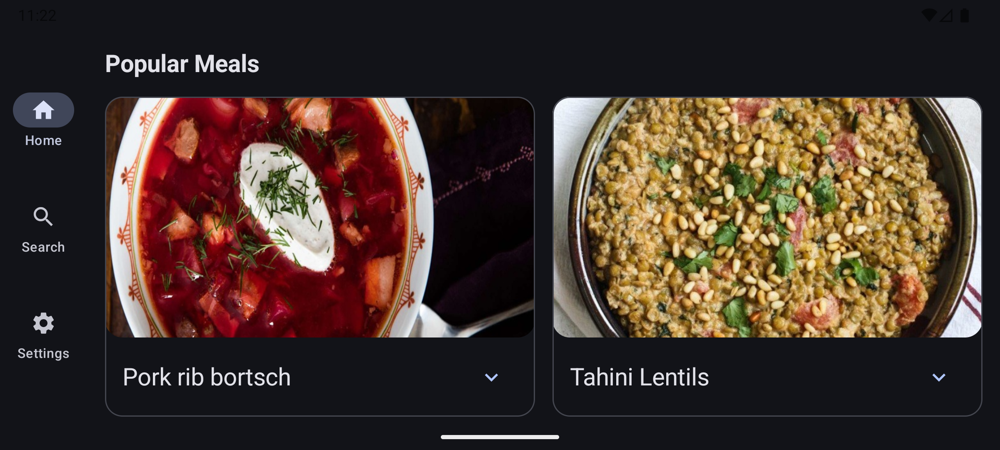
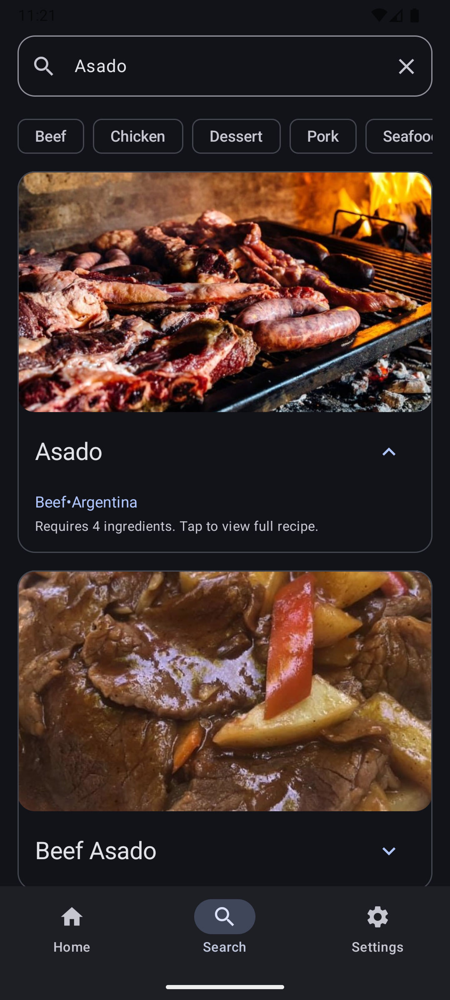
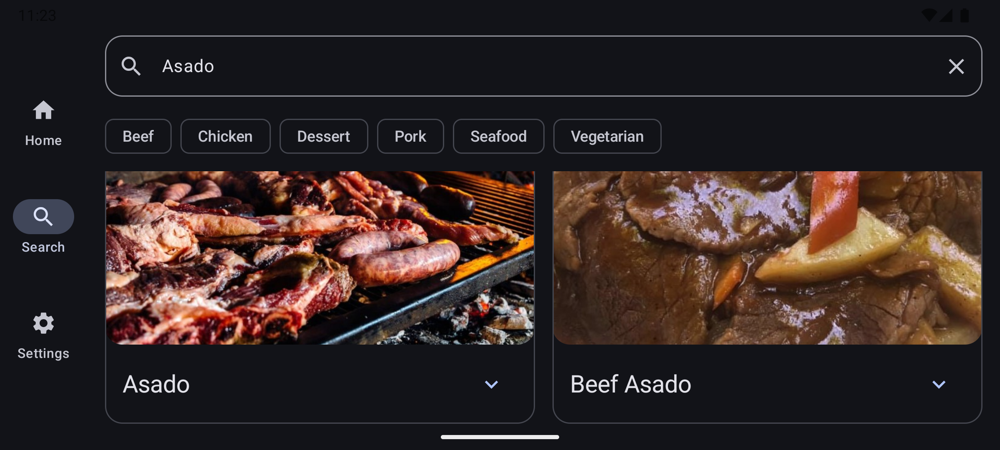
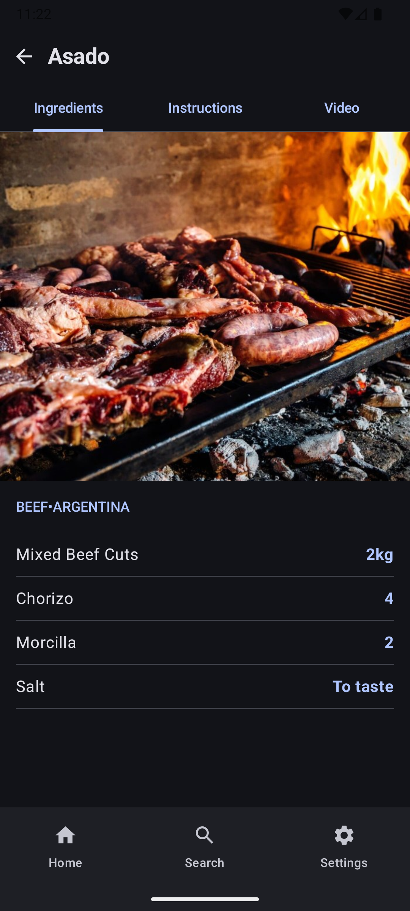
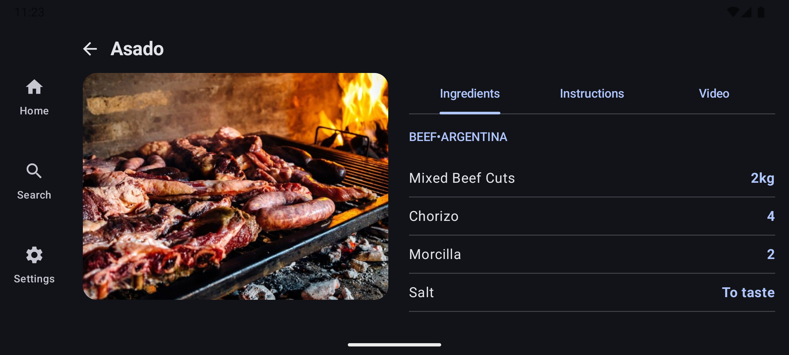
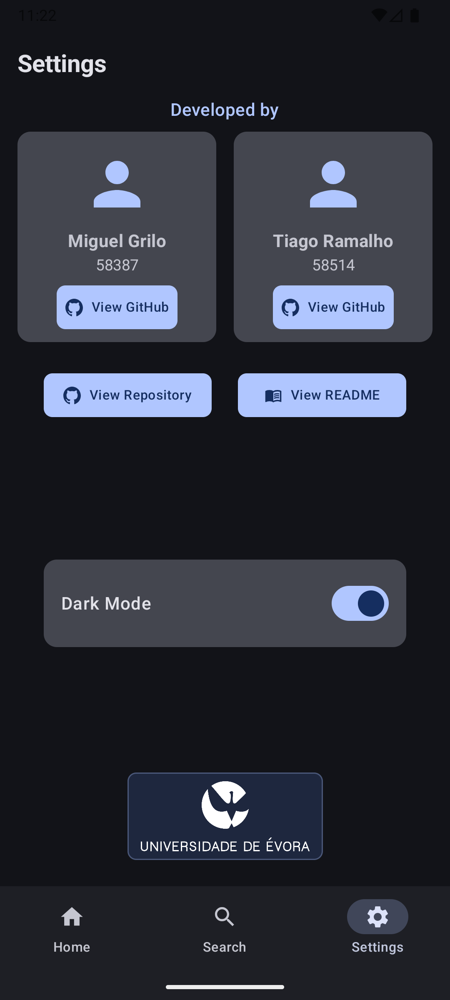
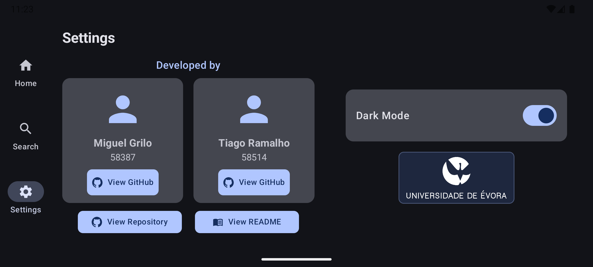

# MealsApp


A modern, fully responsive Android application built with **Jetpack Compose** that allows users to discover, search, and explore recipes from around the world. Powered by the open-source [TheMealDB API](https://www.themealdb.com/).

## UI Showcase

The application features a fully responsive design, seamlessly adapting to different screen sizes and supporting both **Portrait** and **Landscape** orientations.

| Screen       | Portrait                                              | Landscape                                                |
|:-------------|:------------------------------------------------------|:---------------------------------------------------------|
| **Home**     |          |          |
| **Search**   |      |      |
| **Details**  |    |    |
| **Settings** |  |  |

---

## Features

* **Discover Meals**: Browse a curated list of random popular meals on the Home screen.
* **Search & Filter**: Search for specific recipes by name or filter them by popular categories (Beef, Chicken, Vegetarian, etc.).
* **Detailed Recipes**: View comprehensive meal details, including high-quality images, ingredients with measurements, step-by-step instructions, and direct links to YouTube video tutorials.
* **Dark/Light Theme**: Fully supported dynamic theming with a manual toggle in the Settings screen.
* **Offline-ready UI States**: Graceful handling of Loading, Success, and Error states ensuring a smooth user experience even on poor networks.

## Tech Stack & Libraries

This project leverages modern Android development practices and libraries:
* **UI**: [Jetpack Compose](https://developer.android.com/jetpack/compose) with Material Design 3 guidelines.
* **Architecture**: MVVM (Model-View-ViewModel) + Clean Architecture principles.
* **Networking**: [Retrofit2](https://square.github.io/retrofit/) & [kotlinx.serialization](https://github.com/Kotlin/kotlinx.serialization) for robust API communication.
* **Image Loading**: [Coil](https://coil-kt.github.io/coil/compose/) for asynchronous image fetching and caching.
* **Navigation**: Compose Navigation with custom typed routes and seamless state restoration.
* **Concurrency**: Kotlin Coroutines & Flows for asynchronous and reactive programming.

## Architecture & Project Structure

The application follows the **MVVM (Model-View-ViewModel)** architectural pattern combined with **Clean Architecture** principles to ensure a decoupled, scalable, and highly testable codebase.

```text
com.app.meals
├── data/
│   ├── dto/                # API Data Transfer Objects
│   ├── mapper/             # Data transformation logic (DTO -> Domain)
│   └── repository/         # Implementation of data sources
├── model/                  # Domain Models
├── network/                # Retrofit API Services
└── ui/
    ├── components/         # Reusable UI elements (MealCard, etc.)
    ├── screens/            # Screen-level Composables
    ├── theme/              # Typography, Colors, and Theme definitions
    └── viewModels/         # UI State holders and business logic
```

### Layer Breakdown:
* **Domain Layer (`model`)**: Contains the core `Meal` entity representing the business logic. It has zero Android or framework dependencies.
* **Data Layer (`data` & `network`)**:
    * **DTOs & Mappers**: Data Transfer Objects (`MealDTO`) accurately represent the raw network responses. Mappers cleanly transform these DTOs into Domain models, automatically filtering out invalid, null, or empty API data.
    * **Repositories**: `MealsRepository` acts as the single source of truth for meal data, abstracting the network calls away from the UI.
    * **Dependency Injection**: A manual `AppContainer` is used to provide singleton instances of repositories and network services across the app, avoiding the overhead of heavy DI frameworks.
* **Presentation Layer (`ui`)**:
    * **ViewModels**: Manage UI states (`Loading`, `Success`, `Error`) and expose data to the UI. They handle business logic execution via Coroutines and `viewModelScope`.
    * **Screens & Components**: Fully modularized, stateless and stateful Compose functions separated for maximum reusability (e.g., `ExpandableMealCard`, `MealsList`).

## Testing Strategy

Quality assurance is a primary focus of this project. The app features a comprehensive and robust testing suite:

* **Unit Tests**:
    * **Data Mappers**: Rigorous testing of the `MealMapper` to ensure null-safety and data sanitization from the external API.
    * **ViewModels**: Tested using `kotlinx-coroutines-test` and a `FakeMealsRepository` to validate business logic, state transitions, and error handling without hitting the real network.
* **Instrumented UI Tests**:
    * **Screen Validations**: End-to-end UI tests for Home, Search, Details, and Settings screens using `ComposeTestRule`.
    * **Navigation & Interaction**: Automated simulation of user inputs, typing in search bars, and tab switching functionality.
      * **Accessibility Tests**:
          * Thorough verification of semantic properties, touch targets, and `contentDescription` tags to ensure the app is fully navigable via screen readers (TalkBack) and accessible to all users.

## Course Guidelines Checklist (Android Basics with Compose)

This project was developed adhering strictly to the guidelines and objectives set forth in the \"Android Basics with Compose\" course. Here is a comprehensive checklist of all the topics covered and implemented within this application:

### Unit 1: Your First Android App
- [x] **Kotlin Basics:** Utilized variables, functions, and fundamental Kotlin syntax throughout the codebase.
- [x] **Android Studio Setup:** Project initialized, configured, and tested on both emulators and physical devices.
- [x] **Basic Layouts:** Leveraged Jetpack Compose to build interfaces using `Text` and `Image` composables with customized `Modifier`s.

### Unit 2: Building App UI
- [x] **Advanced Kotlin Concepts:** Employed conditional statements (`when`, `if/else`), safe nullability handling (`?`, `?:`), Object-Oriented patterns (Data classes, Sealed interfaces), and lambda expressions.
- [x] **State & Interactivity:** Implemented interactive elements (`IconButton`, `Button`, `FilterChip`) and handled UI state changes using `remember` and `mutableStateOf` (e.g., `ExpandableMealCard` expanded state).
- [x] **State Hoisting:** Successfully hoisted state to parent composables or ViewModels to keep components stateless and reusable (e.g., passing `onQueryChange` and `onSearchClick` down to `SearchScreen`).

### Unit 3: Displaying Lists and Material Design
- [x] **Kotlin Collections & Generics:** Utilized lists (`List<Meal>`) and higher-order collection functions (`map`, `filterNotNull`, `take`, `shuffled`) extensively in data processing and repository logic.
- [x] **Scrollable Lists:** Implemented `LazyVerticalGrid` to display adaptive, scrollable grids of meal cards (`MealsList` component).
- [x] **Material Design 3:** Applied Material Design 3 principles, including dynamic theming (Dark/Light mode support), customized typography, shapes, and color schemes (`Theme.kt`, `Color.kt`, `Type.kt`).
- [x] **Animations:** Added simple animations like `animateContentSize()` for expanding/collapsing meal cards.
- [x] **Accessibility:** Incorporated `contentDescription` tags and implemented specific instrumented tests to ensure TalkBack compatibility and proper touch targets.

### Unit 4: Navigation and App Architecture
- [x] **Recommended Architecture:** Adopted the official Google architecture guidelines, separating concerns into UI, Domain, and Data layers using `ViewModel`s and Repositories.
- [x] **State Management:** Used `StateFlow` and Compose `State` to manage and observe UI states safely and reactively across screens.
- [x] **Navigation Component:** Integrated Compose Navigation (`NavHost`, `NavController`) with typed routes (`home`, `search`, `settings`, `details/{mealId}`) and bottom/rail navigation bars.
- [x] **Adaptive Layouts:** Utilized `WindowWidthSizeClass` and device orientation checks (`isPortrait`) to create adaptive layouts that switch between a `NavigationBar` (bottom) on compact screens/portrait and a `NavigationRail` (side) on larger screens/landscape.

### Unit 5: Connecting to the Internet
- [x] **Coroutines & Asynchronous Programming:** Heavily relied on Kotlin Coroutines (`viewModelScope.launch`, `async`, `awaitAll`) for concurrent and non-blocking background tasks.
- [x] **Networking with Retrofit:** Used `Retrofit2` to perform HTTP GET requests to the external REST API (TheMealDB).
- [x] **JSON Serialization:** Implemented `kotlinx.serialization` to parse complex JSON responses into structured `MealDTO` objects.
- [x] **Loading Images from the Web:** Integrated the `Coil` library (`AsyncImage`) to asynchronously fetch, cache, and display meal images seamlessly within the Compose UI.
- [x] **UI State Handling:** Designed distinct UI states (Loading, Success, Error) to handle network latency and failures gracefully across all main screens.

## Developers

Developed by:
* **Miguel Grilo** (58387) - [GitHub Profile](https://github.com/MiguelGrilo)
* **Tiago Ramalho** (58514) - [GitHub Profile](https://github.com/tiagomanuelvr)

*University Of Évora*